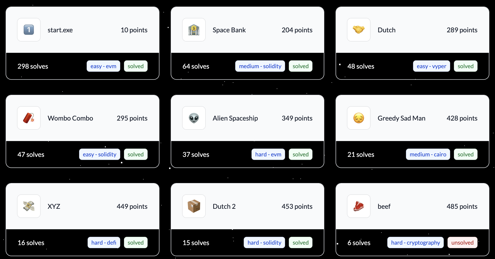

# OpenZeppelin Ethernaut CTF Writeup



Following is a writeup for problems I solved

## Wombo Combo

This problem is related to the [ERC2771 Multicall Vulnerability](https://blog.openzeppelin.com/arbitrary-address-spoofing-vulnerability-erc2771context-multicall-public-disclosure), which let hacker be able to impersonate any address as `_msgSender()` to bypass all access controls.

The bug is because in `_msgSender()`, it uses the last 20 bytes of calldata as the sender, which should be verified by the `Forwarder` contract and safely appended to the end of calldata. However, the `Multicall` feature allows anyone to specify any sequence of calldata in one single call, and only the whole `multicall()` function needs to be verified by the `Forwarder` contract. So we can append any address to the end of multicall's calldata to impersonate any address.

There are two `onlyOwner` function that we can utilize to get all of the reward: `setRewardsDuration` and `notifyRewardAmount`. If we call `setRewardsDuration(1)` and then `notifyRewardAmount(1e8 * 1e18)`, the `rewardRate` can be set to `1e8 * 1e18`, and we can call `getReward()` to get all of the reward. So the way to assemble calldata for `multicall` is:

```solidity
bytes[] memory multicallData = new bytes[](2);
multicallData[0] = abi.encodePacked(
    abi.encodeWithSelector(
        staking.setRewardsDuration.selector,
        uint256(1)
    ),
    staking.owner()
);
multicallData[1] = abi.encodePacked(
    abi.encodeWithSelector(
        staking.notifyRewardAmount.selector,
        uint256(100_000_000 * 10 ** 18)
    ),
    abi.encodePacked(staking.owner())
);
bytes memory muticallEncoded = abi.encodeWithSelector(
    staking.multicall.selector,
    multicallData
);
```

The main attack sequence is:

1. Call `stake()` to stake all tokens
1. Call `forwarder.execute()` with following params:
   - `from` is player address
   - `to` is staking contract address
   - `data` is the calldata encoded for `multicall` above
   - `signature` should be signed using player's private key
1. Call `getReward()` to get all of the reward

## XYZ

## Dutch 2

The checkState uses `auction.data.quoteLowest != type(uint128).max` to determine whether it's Final or Reveal state. So if I set `quoteLowest = type(uint128).max` in `finalize()`, the contract will believe it's still in `Reveal` state, then call `finalize()` again for seller to get more quote tokens

To succeed in this attack, a main condition to get around is `quote.mulDivDown(type(uint128).max, base)` should equal `data.prevQuoteBase`
which means `quote * (2**128-1) / base == last amountQuote * (2**128-1) / amountBase`

The quote should be `2**128-1`, but we don't have that much quote token to be set in `amountQuote`, so I set `amountBase = 1` and the condition becomes `(2**128-1) == base * last amountQuote`

Which means I need to find a base large enough to only need less `amountQuote`, but not greater than `100e18` because we only have that much base token.

Factorize `2**128-1` and find the most suitable one is `92826887214783219843 * 3665773755114633685`, which are around `92e18` and `3.66e18`. So I just need to let seller sell 92e18 base tokens and the bidder bids 3.66e18 for 1 wei of base token, then call `finalize()` twice to get more quote tokens then I deposited before.
